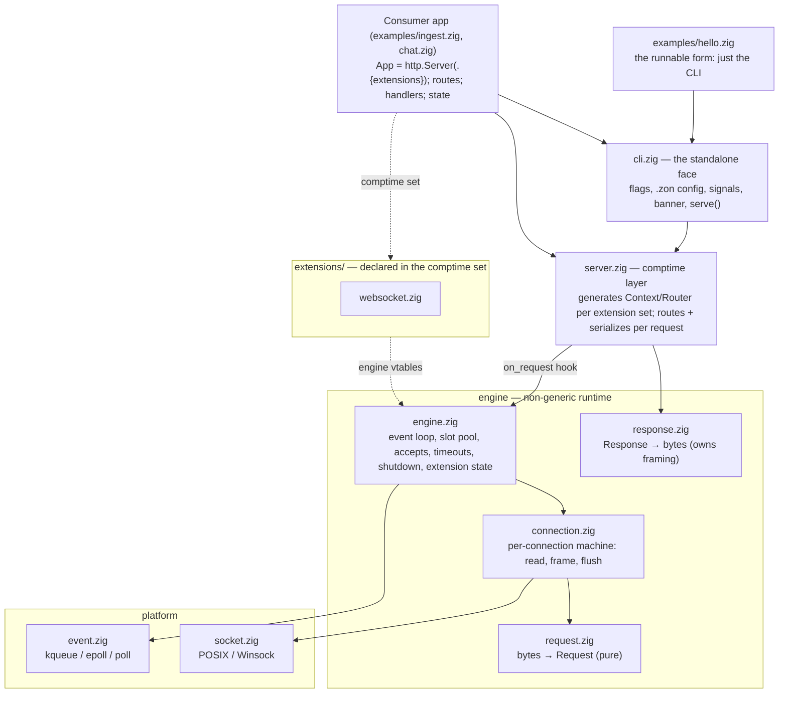

# Architecture

A fixed-capacity, single-threaded HTTP/1.1 server **library** in pure Zig. Apps are
composed at compile time: `http.Server(.{ .websocket = ... })` takes
the extension set as a comptime parameter and generates the app type — its typed
handler context, its router, its contract. Handlers are
`fn (req, res, ctx: *App.Context) !void`: wire data in `req`, the response in `res`,
everything environmental (app state, arena, server, typed extensions) in `ctx`.
The smallest runnable form is examples/hello.zig — a two-line main mounting the CLI —
and `zig build run` runs it; consumers (Publr) mount that same CLI from their own main.

## The shape

## Design rules

1. **Comptime composition.** The extension set is a compile-time parameter; the
   `App.init` type spells out the complete inventory of what a server can do. The
   generated `Context` has one typed field per extension (`ctx.extensions.websocket`),
   so handlers never reach for module-level state — everything arrives via params. An
   extension a consumer doesn't declare is never compiled.

2. **Fixed capacity, allocated once.** `App.init` preallocates everything the server
   will ever use: one slot per connection (fd, state, fixed read/write buffers), a
   shared per-request arena, a free-slot stack, and each extension's state. The hot
   path never allocates. Every bound has a defined overflow behavior: no free slot →
   503, oversized head → 431, oversized body → 413, full kernel buffers → TCP
   backpressure. There is no request queue object anywhere.

3. **Single-threaded, single-process, permanently.** One server is one event loop on
   one thread in one process: no locks, no data races, no sharded state, and the
   state-machine assertions depend on it. Everything in the server — counters,
   WebSocket groups, app state — is globally true because there is exactly one of it.
   Scaling past one core means running more instances behind your own balancer, and
   treating them as the separate servers they are.

4. **The CLI is the standalone face, not a library feature.** Every example's main is
   a two-line mount of `cli.serve(App, init, ...)`, and your program mounts the same
   entrypoint from its own main or build command. It owns everything app-shaped: flags, .zon
   config, validation, shutdown signals (the library core never
   installs process-global signal handlers uninvited), the banner, exit counters.
   Non-CLI embedders drive `App.init` / `listen()` directly.

5. **Generic front, non-generic engine.** Only the thin comptime layer (server.zig,
   router.zig's `Router(Context)`) is generic. The runtime engine — loop, slots,
   framing, flushing, extension plumbing — is plain non-generic code reached through
   one `on_request` function pointer. Extensions implement a small engine vtable
   (init/deinit + optional connection-takeover hooks) and stay non-generic too.

6. **Runtime capacity in `Options`, compile-time limits in constants.** Ports, buffer
   sizes, timeouts are one `Options` struct (fillable from code, a .zon
   file, or CLI flags). API-shape limits (max routes, max params) are compile-time
   constants sizing embedded arrays — changing one is a one-line edit and a recompile,
   not a knob to misconfigure.

7. **Pure at the edges, zero hot-path event syscalls.** `request.zig` is a pure
   function from bytes to a struct — no I/O, no allocation. `response.zig` owns all
   framing headers and validates handler-supplied bytes, so a handler can neither
   desynchronize the connection nor let attacker input inject headers. Event interest
   is registered once per connection (level-triggered kqueue/epoll; portable poll()
   fallback for Windows/dev); only a short write ever toggles it.

8. **The consumer surface is what `lib.zig` exports; everything else is private, and
   the amalgamation makes that literal.** In the source tree `pub` means "another
   file needs this" — Zig has one visibility level, so `connection.zig`'s functions
   are `pub` for `engine.zig`'s sake. The test for what `lib.zig` exports is a use
   case: if there is no easy "a consumer would write this" for a declaration, it is
   not exported (`Engine`, `Slot`, the parser, the response writer, the router's
   dispatch are all in that set). `zig build amalgamate` then regenerates the library
   as one file, `zig-out/publr_http.zig`, with every source file inlined as a
   namespace and `pub` recomputed as "reachable from the root through its `pub`
   aliases" — inside one file sibling containers reach each other without `pub`, so
   nothing below the surface can even be named from outside — with tests and
   everything only tests referenced stripped. Both the test suite and `zig build
   docs` run against that file, not the source tree. A consumer-visible thing that
   is undocumented, or an internal thing that shows in the reference, is a failed
   build-time audit, not a matter of convention. Two consequences when adding code:
   a function a consumer must call on a public type is a `pub` method of it, while
   a function only the engine calls is a free function in the file's namespace, so
   it does not ride into the surface; and a parameter or local may not be named
   like anything `lib.zig` exports (`extensions`, `process`, `static`, …), nor may
   a nested container's member be referenced bare under that name — the
   amalgamator reports both with a location.

## One request

Kernel reports a readable connection → `server.tick` decodes the event token to a slot
(a generation counter rejects events for recycled slots) → `connection.zig` drains
`recv` into the slot's buffer and `request.zig` parses it → the engine hands the
complete request to server.zig's `on_request`, which builds the typed `Context`, routes
through the app's `Router` (method + pattern, `:param` captures, middleware), and calls
the consumer handler → the response serializes into the slot's write buffer → `send`,
usually completing inline. Keep-alive returns the slot to reading; pipelined requests
are served under a fairness budget so one client can't starve the loop. Details:
[docs/request-lifecycle.md](docs/request-lifecycle.md).

## Extensions

An extension module exports two things: `State` (the per-server state handlers see as
`ctx.extensions.<name>`, with the extension's consumer-facing methods on it) and
`extension` (its engine vtable: `init`/`deinit` lifecycle plus optional
connection-takeover hooks). The engine owns the state end to end. What a consumer
passes to `Server` is the curated `http.extensions.<name>` namespace from `lib.zig` —
`State` and the callback types, nothing engine-side; `server.zig` finds the vtable in
its own registry, keyed by `State`. Extensions are in-tree by design, so the registry
is the complete list.

Takeover, when an extension does it, starts inside an ordinary route handler: the
extension queues its switching response on the slot, and once that drains the slot
leaves the HTTP pipeline for good — its events go to the extension's hooks.

- **websocket** (`extensions/websocket.zig`) — RFC 6455. An endpoint is a normal route
  whose handler calls `ctx.extensions.websocket.upgrade(ctx, req, .{ .on_message = ... })`;
  false means "not a handshake" and the handler serves plain HTTP (426). Rooms are
  consumer-side (`ws.Group`): connections are cheap, generation-guarded values safe to
  store and send to later.

## Observability

The server counters are an always-on engine feature, not an extension: `Counters` is a
plain struct of tallies embedded in the engine (`engine.counters`), recorded with bare
integer increments on paths that just did a syscall — effectively free, so there is no
off switch. Handlers read them as `ctx.counters` (the struct serializes directly:
`res.json(.ok, .{ .stats = ctx.counters.* })`), embedders read `app.engine.counters`,
and the CLI prints them as the exit summary. They never touch the
wire unless a handler serves them. `process.zig` is the companion utility module —
plain functions `id()` and `cpu_micros()` for `/stats`-style endpoints; nothing in it
runs unless called.

## Module map

| Module | Owns |
|---|---|
| `lib.zig` | The consumer surface: `Server(...)`, typed exports, `cli`, `process`, `static`, `extensions` |
| `main.zig` | The standalone file-server binary (`publr-http`): one wildcard route over `--root` |
| `cli.zig` | Flags (built-in + app-declared), .zon config, validation, banners, exit counters, `serve()` |
| `server.zig` | Comptime layer: generates `Context`/`Router`, routes + serializes |
| `engine.zig` | Engine: event loop, slot pool, accepts, timeouts, shutdown, extensions |
| `connection.zig` | Per-connection machine: read → frame → hand off → flush → close |
| `http/router.zig` | Pattern matching, `:params`, middleware chain, 404 (generic over Context) |
| `http/request.zig` | Parsing (pure); Content-Length framing only |
| `http/response.zig` | Serialization; owns framing headers, validates handler input |
| `http/status.zig` | The status codes this server can produce |
| `static.zig` | Static file serving: safe path resolution, MIME by extension, `serve_file` |
| `process.zig` | Process introspection utilities: `id()`, `cpu_micros()` |
| `platform/event.zig` | Readiness backends: kqueue, epoll, poll |
| `platform/socket.zig` (+ impls) | Socket + OS calls behind one surface: raw syscalls on Linux (no libc, binaries stay fully static), Winsock on Windows, POSIX libc on Darwin/BSD |
| `extensions/` | `websocket.zig` |

## Deliberately absent

TLS (terminate at a proxy), HTTP/2+, chunked transfer encoding, threads, worker
processes (one instance is one core; run more instances behind your own balancer), a
request queue, WebSocket fragmentation/compression, and any runtime plugin system —
the extension set is comptime, tied together upfront. Windows support is dev-grade
(poll backend); production targets are POSIX.
