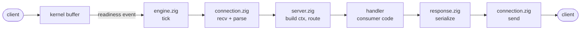

# Request lifecycle

Where is a request handled? Set a breakpoint in `connection.zig: process_requests` —
every request on every connection passes through it. One call down, the engine hands
the request to `server.zig: on_request`, which builds the handler context and dispatches
through the router to the matching route handler (consumer code; `examples/ingest.zig`
here).

`request.zig` contains no I/O: it is a pure function from bytes to a `Request`. The
per-connection machinery lives in `connection.zig`; `engine.zig` runs the event loop
around it.

## One request, wire to wire

Everything below runs back to back on the single event-loop thread; nothing blocks or
queues in between.

1. The event loop (`event.zig`: kqueue on macOS/BSD, epoll on Linux, poll() fallback on
   Windows or via `-Devent-backend`) reports which connections are ready. Each event
   carries a token; `engine.zig: tick` decodes it into a slot (a generation counter
   rejects events for closed-and-reused slots) and routes by slot state.
2. `connection.zig: service_reading` calls `recv` until the kernel is drained or the
   slot's fixed read buffer is full.
3. `request.zig: parse` runs on the buffered bytes. Complete head + fully buffered body
   yields a `Request`; incomplete means wait for more bytes; malformed gets an error
   response and the connection closes.
4. `process_requests` serves buffered requests in a loop (pipelining) up to a fairness
   budget, handing each to `server.zig: on_request`, which wraps it into the handler-facing
   `Request`, builds the typed `Context` (app state, arena, extensions), and dispatches
   through the app's router — method + pattern match, middleware, then the route handler
   (or the 404 handler).
5. `response.zig: write_to` serializes the response into the slot's write buffer, and
   `flush` sends it. Usually this completes inline; only when the kernel's send buffer
   is full does the slot wait for a writable event to finish.
6. On keep-alive the slot goes back to reading with an idle deadline; on
   `Connection: close`, error, or shutdown, the slot is recycled.

## Who owns what

| File | Owns |
|---|---|
| `server.zig` | Comptime layer: builds the typed `Context`, routes, serializes |
| `engine.zig` | Engine: event loop, slot pool, accepts, timeouts, shutdown; all memory preallocated at init |
| `connection.zig` | Per-connection machine: read, frame, hand off, write, close |
| `platform/event.zig` | Kernel readiness (kqueue / epoll / poll), level-triggered |
| `platform/socket.zig` | Raw socket calls; POSIX and Winsock behind one surface |
| `http/request.zig` | Bytes → `Request`; pure, Content-Length framing only |
| `http/response.zig` | `Response` → bytes; owns all framing headers |
| `http/router.zig` | Method + pattern matching, params, middleware, 404 |
| `cli.zig` | The command-line face: flags, .zon config, banners |
| `examples/` | The applications: routes and state; the library contains none |

## Slot states and backpressure

A connection is one preallocated `Slot` with three states: **free** (on the free
stack), **reading** (bytes accumulate until a full request is present), **writing** (a
response is draining; usually completes inline). Closing recycles the slot and bumps
its generation.

There is no request queue object. Waiting work lives in four bounded places, each with
a defined overflow behavior: the kernel listen backlog (overflow: connect refused), the
kernel receive buffer (overflow: TCP backpressure), the slot read buffer (overflow:
431/413 and close), and the pending mark for slots whose pipeline budget ran out this
tick (bounded by the slot count). When all slots are taken, new connects get a
best-effort 503 and are closed. One flooding client can only fill its own buffers.
